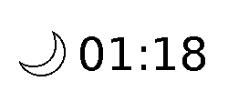

# Pipaper

## What is Pipaper?

Pipaper is a custom made Raspberry Pi based e-paper display that shows the current time and weather condition (icon). 

The weather data is fetched from [WeatherAPI](https://www.weatherapi.com/).

## Hardware

* Raspberry Pi Zero 2 WH + 64GB microSD card
* Raspbian OS (Bookworm) 64-bits with SPI enabled
* Waveshare 2.13inch e-Paper HAT (V4) 255x122 pixels
* Python 3.10.12 Virtual Environment
  
## Software

### WeatherAPI

* https://www.weatherapi.com/docs/
* https://www.weatherapi.com/docs/weather_conditions.json

### Waveshare e-Paper Display

* https://github.com/waveshareteam/e-Paper/tree/master/RaspberryPi_JetsonNano/python/lib/waveshare_epd
* https://github.com/waveshareteam/e-Paper/blob/master/RaspberryPi_JetsonNano/python/examples/epd_2in13b_V4_test.py
