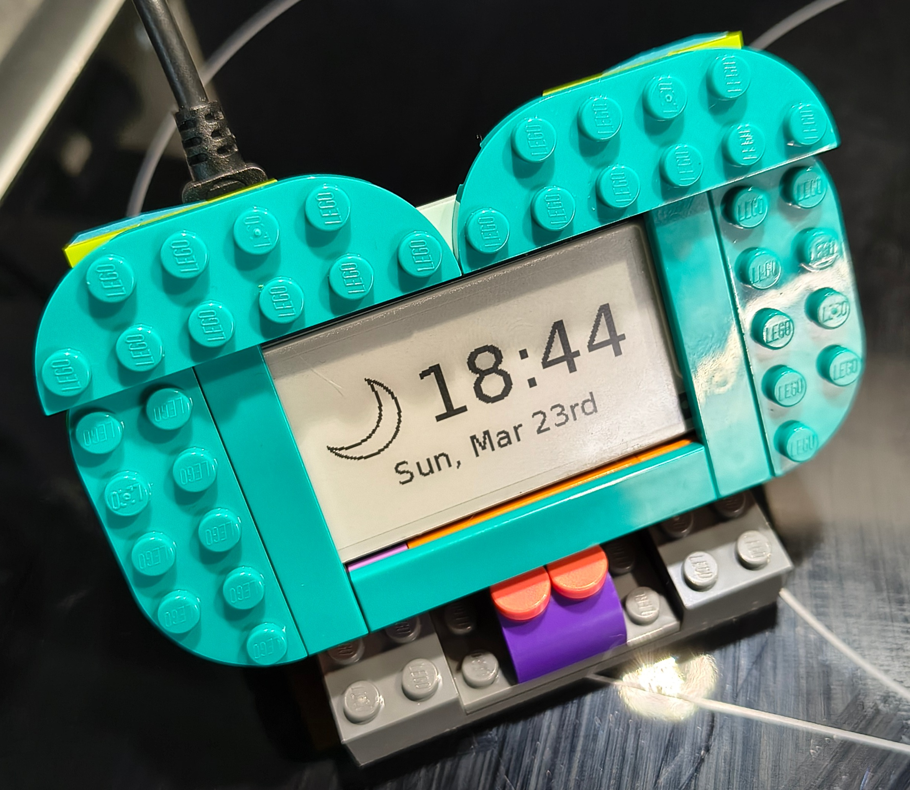

# Pipaper

## What is Pipaper?



Pipaper is a custom made Raspberry Pi based e-paper display that shows the 
current time and weather condition (icon). The weather data is fetched from [WeatherAPI](https://www.weatherapi.com/).

## Hardware

* Raspberry Pi Zero 2 WH + 64GB microSD card
* Raspbian OS (Bookworm) 64-bits with SPI enabled
* Waveshare 2.13inch e-Paper HAT (V4) 255x122 pixels
* Python 3.10.12 Virtual Environment
  
## Software

## Installation

### Clone the repository

```bash
git clone github.com/olafrv/pipaper.git
cd pipaper
```

### Install dependencies

Without a virtual environment:
```bash	
sudo apt install --yes $(cat requirements.txt | sed 's/^/python3-/g')
```

With a virtual environment:
```bash
python3 -m venv .venv
source .venv/bin/activate
pip install -r requirements.txt
```

### Configuration

Create `.env` file with the following content:

```bash
WEATHER_API_KEY="weather_api_key"
WEATHER_API_LAT="47.7796"
WEATHER_API_LON="10.6183"
EPAPER_WIDTH=250
EPAPER_HEIGHT=122
```

### Run the application

```bash
python3 main.py
```

### Run the application on boot

```bash
bash service.sh  # Install the service on boot
journalctl -u pipaper  # Check the service logs
# sudo systemctl stop pipaper
# sudo systemctl start pipaper
```

### WeatherAPI

* https://www.weatherapi.com/docs/
* https://www.weatherapi.com/docs/weather_conditions.json

### Waveshare e-Paper Display

* https://www.waveshare.com/wiki/2.13inch_e-Paper_HAT_Manual (Version 4)
* https://github.com/waveshareteam/e-Paper/tree/master/RaspberryPi_JetsonNano/python/lib/waveshare_epd
* https://github.com/waveshareteam/e-Paper/blob/master/RaspberryPi_JetsonNano/python/examples/epd_2in13b_V4_test.py
